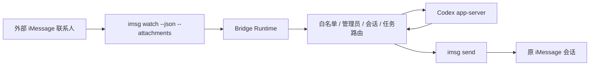

# iMessage Codex Bridge

在一台已登录 iMessage 的 macOS 电脑上，把外部 iMessage 文本/图片输入桥接到本机 `Codex app-server`，再把 Codex 的文本回复发回原会话。

这个项目面向**本机自用**场景：白名单联系人给你的 Mac 发 iMessage，bridge 负责监听、路由、会话续接、长任务状态通知，以及管理员通过 iMessage 动态管理联系人和 workspace。

## 它现在能做什么

- 白名单联系人接入，非白名单自动回复 `请联系管理员开通权限。`
- 一联系人一独立 workspace，默认目录位于 `~/.imessage-codex-agent/workspace/<handle>`
- 每个联系人维护自己的会话列表，支持 `/new`、`/list`、`/current`、`/switch`
- 普通消息自动续接当前会话，短时间内的碎片消息会自动合并
- 支持图片入站理解：图片会暂存后以 `localImage` 形式提交给 Codex
- 支持长任务后台化：`/task`、`/research`、`/jobs`、`/status`、`/cancel`、`/logs`
- 长任务支持慢任务提醒、心跳播报、阶段播报、超时、取消、重启恢复
- 管理员可直接通过 iMessage 动态执行 `/bridge allow|list|workspace|remove|help`
- 已处理自发消息过滤、重复消息去重、app-server 通知竞态、turn 超时/取消清理、loop 异常兜底

## 工作方式



## 运行前提

- macOS，且本机 `Messages/iMessage` 已正常登录
- 已安装 `imsg`，并让终端拥有 Messages / Full Disk Access 等必要权限
- 已安装 `codex` CLI，且本机可执行 `codex app-server --listen stdio://`
- Node.js `>=22`，并通过 `Volta` 管理

> [!IMPORTANT]
> 这个 bridge 不是云服务，也不是公网部署方案。它依赖**这台 Mac 本机**的 iMessage 和 `codex app-server` 持续运行。

## 快速开始

### 1. 安装依赖

```bash
cd /Users/akimixu/Desktop/Projects/imessage-codex-bridge
npm install
# 或
pnpm install
```

### 2. 准备配置

启动时会优先读取 `config/bridge.local.yaml`；如果本地私有配置不存在，才回退到 `config/bridge.example.yaml`。

推荐做法：

- `config/bridge.example.yaml`：放匿名示例，适合提交到 Git
- `config/bridge.local.yaml`：放你自己机器上的真实号码、邮箱、管理员名单和 workspace，不提交到 Git

当前示例配置：

```yaml
rejectionMessage: 请联系管理员开通权限。
messageMergeWindowMs: 5000
adminHandles:
  - "+8613800000000"
contacts:
  - handle: "+8613800000000"
    name: 管理员
    workspace: "/Users/yourname/.imessage-codex-agent/workspace/8613800000000"
```

字段说明：

| 字段 | 说明 |
| --- | --- |
| `rejectionMessage` | 非白名单联系人收到的固定回复 |
| `messageMergeWindowMs` | 同一联系人消息合并窗口，单位毫秒 |
| `adminHandles` | 可执行管理员命令的联系人列表 |
| `contacts[].handle` | 白名单联系人标识，支持手机号或 iMessage 邮箱 |
| `contacts[].name` | 联系人别名，仅用于展示 |
| `contacts[].workspace` | 该联系人的默认 Codex 工作目录 |

如果你已经在本机使用真实配置，建议新建 `config/bridge.local.yaml`，内容可以从 `config/bridge.example.yaml` 复制后按本机实际值修改。

### 3. 构建并启动

```bash
npm run build
npm run dev

# 或
pnpm build
pnpm dev
```

启动成功后会输出类似日志：

```text
bridge ready: {
  "executablePath": ".../imsg",
  "contactCount": 2,
  "statePath": ".../data/bridge-state.json",
  "attachmentDirectory": ".../data/attachments",
  "watchArgs": ["watch", "--json", "--attachments"]
}
```

## 数据与目录

默认运行数据位于仓库内：

- 状态文件：`data/bridge-state.json`
- 图片暂存目录：`data/attachments`
- 联系人默认 workspace 根目录：`~/.imessage-codex-agent/workspace`

bridge 启动时会：

1. 读取配置
2. 检查 `imsg` 是否可用
3. 创建/恢复联系人 workspace
4. 拉起本地 `codex app-server`
5. 恢复联系人、会话、线程、任务状态
6. 开始监听 `imsg watch --json --attachments`

## 权限模型

- **管理员联系人**：按管理员权限运行，可通过 `/bridge` 管理白名单和 workspace
- **普通白名单联系人**：允许在自己的 workspace 内工作
- **非白名单联系人**：只会收到拒绝文案，不会进入 Codex

当前设计目标是：

- 管理员拥有完全控制权
- 非管理员只绑定到自己的 workspace
- 联系人之间会话、workspace、任务互相隔离

## 管理员命令

管理员直接通过 iMessage 发送：

```text
/bridge list
/bridge allow <handle> <name> [workspace]
/bridge workspace <handle> <workspace>
/bridge remove <handle>
/bridge help
```

说明：

- `allow` 不传 `workspace` 时，会自动创建 `~/.imessage-codex-agent/workspace/<handle>`
- `workspace` 会立即更新联系人默认目录，并让当前会话下次在新目录启动
- 所有动态修改都会直接写入 `data/bridge-state.json`
- `name` 或 `workspace` 含空格时请加英文引号

示例：

```text
/bridge allow "user@example.com" "demo-user"
/bridge workspace "+8613800000000" "/Users/yourname/.imessage-codex-agent/workspace/admin-main"
```

## 会话命令

所有白名单联系人都可以发送：

```text
/new
/new 重构支付
新任务
新建会话 接口联调
/list
会话列表
/current
当前会话
/switch 2
切换会话 2
```

规则：

- 每个联系人都有自己的独立会话列表
- 普通消息默认续接当前会话
- `/new` 创建并切换到新会话
- `/switch` 只影响当前联系人自己的会话
- 会话切换前会先冲刷该联系人的旧消息，避免上一会话消息串到新会话

## 任务命令

所有白名单联系人都可以发送：

```text
/task <内容>
/research <目标>
/jobs
/status <任务编号>
/cancel <任务编号>
/logs <任务编号>
```

### 前台任务

- 普通消息默认走前台任务
- 会立即收到：`已收到，Codex 正在处理…`
- 如果较慢，会补发：`还在处理中，请稍等`
- 当前默认超时约 `10` 分钟

### 后台任务

- 文本命中长任务特征，或显式使用 `/task`，会转为后台任务
- 会返回 `jobId`
- 可通过 `/status`、`/logs`、`/cancel` 管理

### `autoresearch`

`/research <目标>` 会自动走 `codex-autoresearch` 后台任务：

- 默认超时约 `8` 小时
- 会把阶段变化映射成 iMessage 播报
- 适合持续修复、全仓扫描、长时间研究类任务

### 长任务播报策略

- 启动、完成、失败、取消：立即通知
- 任务较慢：先发送“还在处理中，请稍等”
- 长时间运行：按心跳播报当前阶段 / 已运行时间
- 心跳节奏会逐步放宽，大致从 `2 / 5 / 15 / 30` 分钟递进
- bridge 重启后，后台任务会自动重新排队；前台任务会标记失败并提示重新发送

## 日志怎么看

推荐直接在前台终端启动：

```bash
cd /Users/akimixu/Desktop/Projects/imessage-codex-bridge
npm run dev

# 或
pnpm dev
```

常见日志：

- `bridge inbound chunk:`：收到一条 `imsg watch` 原始消息
- `bridge dispatch result:`：一轮执行后准备回发到 iMessage 的结果
- `bridge outbound send failed:`：`imsg send` 发送失败
- `bridge attachment staging failed`：图片暂存失败，回退为纯文本提交

## 验证

```bash
npm test
npm run build

# 或
pnpm test
pnpm build
```

当前已验证：

- 全量测试：`34` 个 test files、`134` 个 tests 通过
- TypeScript 构建通过

## 已知限制

- 目前只支持**一对一联系人**，不支持群聊
- 目前只支持**图片理解输入**，不支持图片生成或图片回传
- 当前配置加载规则是“`bridge.local.yaml` 优先，`bridge.example.yaml` 回退”，但还没有做更正式的多环境配置体系
- `imsg send` 失败会记日志，但不会做自动重试队列
- 状态文件损坏时会直接报错退出，需要人工修复 `data/bridge-state.json`
- 长任务能力已完成代码与自动化验证，但还建议再做一次真实手机端到端长跑验收

## 适合什么场景

- 自己给自己的 Mac 发 iMessage，让 Codex 代你处理本机文件
- 少量受控联系人共享一台 Mac 上的 Codex 能力
- 用 iMessage 做“远程命令入口 + 持续会话 + 长任务播报”

## 不适合什么场景

- 面向公网的多人 SaaS
- 需要强审计、强隔离、多租户计费的正式生产系统
- 依赖图片回传、群聊支持、复杂权限编排的场景

## 许可证

当前仓库里**没有**检测到 `LICENSE` 文件；如果后续要开源或分发，建议补上明确许可证。
